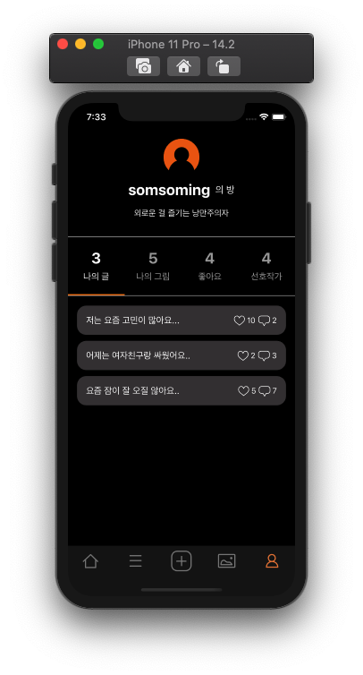

# colorfull_iOS
 

### 프로젝트 소개

---

쉽게 감정을 터놓기 어려운 사회적 환경과 코로나로 인한 사회적 고립으로 인한 심리적 문제를 겪는 인원이 늘고 있다. 이에 이러한 문제를 해결하기 위해 모바일로 해결책을 제시합니다.

* ***Who*** : 고민이 있으나 털어놓지 못하는 사람과 자신의 작품(그림)을 통해 사람들에게 위로와 공감을 전해주고 싶은 사람
* ***How*** : 본인의 고민을 올리고 작가의 작품을 통해 공감/위로 및 이용자들로부터 위로
* ***What*** : 고민 게시자는 고민에 대한 공감과 위로를 얻으며 작가는 이를 통해 만족감과 포트폴리오 획득

 

### 개발 환경

* **Xcode Version 12.2**
* **Swift 5.2**

 

---

### 라이브러리

* **Alamofire 5.2**
* **Kingfisher 5.0**

 

---

### 실행화면

> **스플래쉬 화면**

 

> **홈 화면**

 

> **게시판 화면**

 

> **작가 화면**

 

> **마이 페이지 화면**

 

> **게시글 작성 화면**

 

---

### 팀원

* **[🍎 iOS 개발 윤동민](https://github.com/dongminyoon)**
* **[🍎 iOS 개발 박주연](https://github.com/juyeonblue)**
* **[🔐 Server 개발 홍준엽](https://github.com/junyup0319)**

